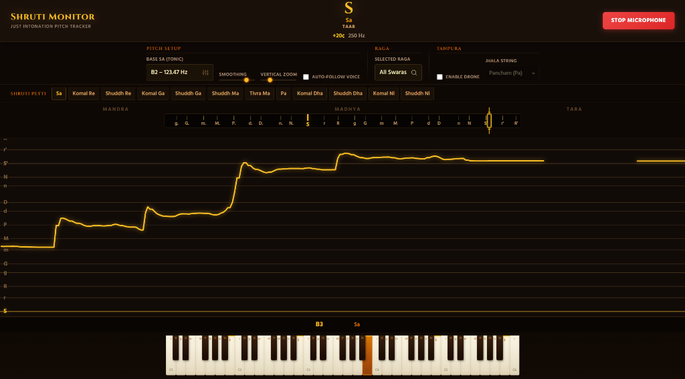
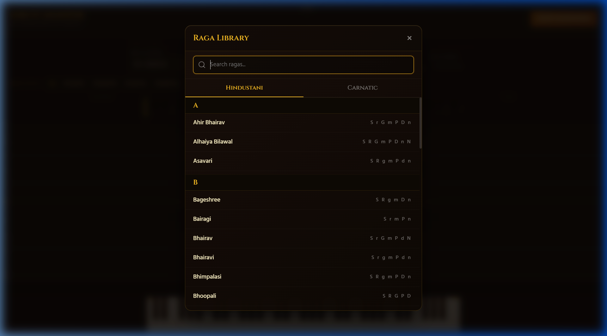
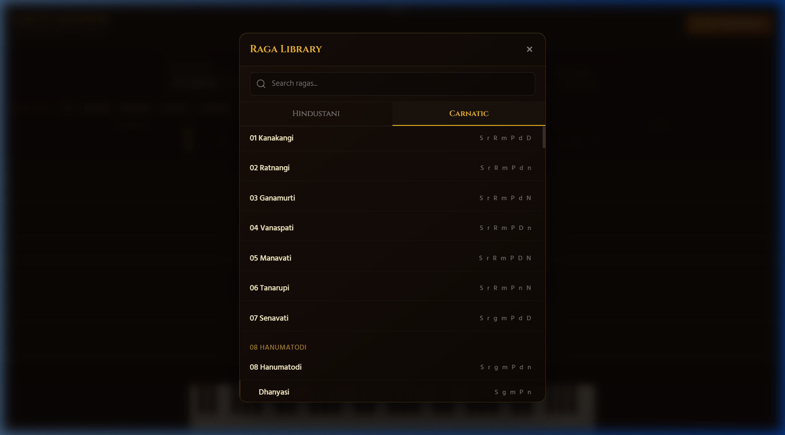
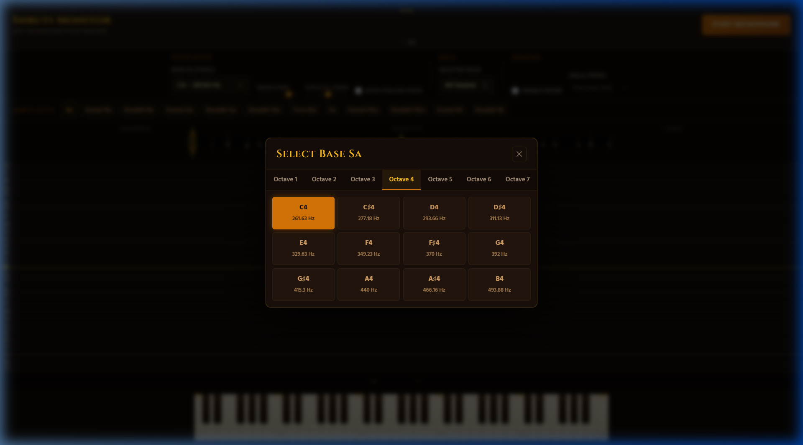

<p align="center">
  
</p>

<h1 align="center">🎵 Shruti Monitor</h1>
<p align="center">
  <strong>Just Intonation Pitch Tracker for Indian Classical Music</strong>
</p>
<p align="center">
  A real-time pitch monitoring tool designed specifically for Indian classical music practice.<br>
  Visualize your shruti accuracy, explore ragas, and train your ear — all in the browser.
</p>

<p align="center">
  <a href="#-key-features">Features</a> •
  <a href="#-live-demo">Live Demo</a> •
  <a href="#-how-it-works">How It Works</a> •
  <a href="#-using-the-app">Usage</a> •
  <a href="#️-technology-stack">Tech Stack</a>
</p>

---

## 🌐 Live Demo

> **[▶ Launch Shruti Monitor](https://hari2897.github.io/shruti-monitor/)**

No installation required — works directly in your browser. Just allow microphone access and start singing.

---

## 📖 Overview

**Shruti Monitor** is a browser-based pitch tracking application built from the ground up for Indian Classical Music (ICM). Unlike standard chromatic tuners that use Equal Temperament, Shruti Monitor uses **Just Intonation** — the mathematically pure tuning system that defines the 22 shrutis of Indian music.

### Why is this different from a regular tuner?

| Feature | Standard Tuner | Shruti Monitor |
|---|---|---|
| Tuning System | 12-TET (Equal Temperament) | Just Intonation (pure ratios) |
| Note Display | C, D, E, F... | Sa, Re, Ga, Ma... (Hindustani & Carnatic) |
| Visualization | Needle / LED | Real-time scrolling pitch graph |
| Musical Context | None | Raga-aware swara filtering |
| Reference Drone | None | Built-in Tanpura & Shruti Petti |

Shruti Monitor helps musicians answer the question: *"Am I singing this swara at the correct shruti?"*

---

## ✨ Key Features

### 🎤 Real-Time Pitch Detection
Detects the fundamental frequency of your voice or instrument using the **McLeod Pitch Method (MPM)** running in an AudioWorklet for low-latency, glitch-free analysis.

### 🎼 Swara Recognition
Instantly displays the detected swara in either **Hindustani** or **Carnatic** nomenclature, along with precise cent deviation from the ideal Just Intonation pitch.

### 📊 Live Pitch Graph
A continuously scrolling canvas visualization plots your pitch trajectory over time against Just Intonation swara lines. Features:
- **Auto-Follow Voice** mode that keeps your pitch centered vertically
- **Horizontal History Scrolling**, allowing you to continuously drag backward up to 10 minutes in the past
- **Pinch-to-Zoom** across the time axis (X-axis) for intricate detail analysis of gamakas
- **Snap to Live** button to instantly snap back to real-time from the past
- **Vertical scrolling** for exploring the full octave range

### 🔴 Session Record & Replay
Record your practice sessions directly in the browser! Once recorded, you can seamlessly replay your audio with mathematically synchronized pitch graphing—allowing you to meticulously review your shruti accuracy after singing. You can also download the audio file directly.

### 🎚️ Pitch Slider
A horizontal bar showing your current pitch position relative to surrounding swaras — perfect for quick glances while performing.

### 🔔 Shruti Petti
Play individual swaras as reference tones. Disabled swaras are automatically greyed out when a raga is selected.

### 🎻 Tanpura Drone
A synthesized 4-string tanpura drone with configurable Jhala string (Pa, Ma, or Ni) provides an authentic practice backdrop.

### 🎹 Interactive Keyboard
A playable harmonium-style keyboard spanning C1–C6, with just-intonation tuned keys and real-time swara labels.

### 🎶 Raga Library
An extensive searchable modal with **Hindustani** and **Carnatic** ragas:
- **Hindustani**: Alphabetically sorted with letter-section headers
- **Carnatic**: Organized by the 72 Melakarta system with Janya ragas nested under their parents

<p align="center">
  
  &nbsp;&nbsp;
  
</p>
<p align="center"><em>Raga Library — Hindustani (left) and Carnatic Melakarta system (right)</em></p>

### 📱 Responsive UI
Fully responsive design that works on mobile, tablet, and desktop. On mobile, controls are hidden behind a slide-up drawer to maximize the pitch visualization area.

---

## 🔬 How It Works

```
┌──────────┐    ┌──────────────┐    ┌──────────────┐    ┌────────────┐    ┌──────────────┐
│ 🎤 Mic   │───▶│ AudioWorklet │───▶│   MPM Pitch  │───▶│ Freq → Sa  │───▶│ Canvas Graph │
│  Input   │    │   Buffer     │    │  Detection   │    │ Ratio Map  │    │ + Slider UI  │
└──────────┘    └──────────────┘    └──────────────┘    └────────────┘    └──────────────┘
```

1. **Microphone Input** — The Web Audio API captures your voice at 44.1 kHz
2. **Audio Buffering** — An `AudioWorkletProcessor` accumulates samples into 2048-sample frames with 50% overlap
3. **Pitch Detection** — The McLeod Pitch Method computes the Normalized Square Difference Function (NSDF), finds peaks via key-threshold selection, and refines with parabolic interpolation
4. **Swara Mapping** — The detected frequency is converted to a ratio relative to the user's chosen Sa (tonic) and mapped to the nearest Just Intonation swara
5. **Visualization** — The pitch is rendered as a smooth trajectory on an HTML5 Canvas, with swara grid lines drawn at mathematically exact positions

---

## 🧠 Pitch Detection: McLeod Pitch Method

Shruti Monitor uses the **McLeod Pitch Method (MPM)**, specifically chosen for musical pitch tracking:

| Property | Detail |
|---|---|
| **Algorithm** | Normalized Square Difference Function (NSDF) |
| **Buffer Size** | 2048 samples (~46ms at 44.1kHz) |
| **Overlap** | 50% hop for smooth tracking |
| **Post-processing** | 3-frame median filter + parabolic interpolation |
| **Frequency Range** | 50 Hz – 2000 Hz |
| **Confidence** | NSDF peak height (0–1) |

**Why MPM over YIN or FFT?**
- Superior accuracy for monophonic vocal pitch
- Robust against harmonics and noise
- Sub-cent precision through parabolic interpolation
- Low computational cost suitable for real-time AudioWorklet processing

---

## 🎯 Using the App

### Quick Start

1. **Open** the application in a modern browser (Chrome, Edge, or Firefox recommended)
2. **Allow** microphone access when prompted
3. **Set your Sa** — Click the Base Sa button to choose your tonic (e.g., C3 at 130.81 Hz)
4. **Start Microphone** — Click the button in the top-right
5. **Sing or play** — Watch your pitch appear on the graph in real time

### Reading the Display

- **Top Bar** — Shows the currently detected swara abbreviation, full name, and cent deviation
- **Pitch Slider** — The golden marker shows your position on the swara scale; labels show Mandra, Madhya, and Tara saptak
- **Graph** — Horizontal gold lines represent Just Intonation swaras; your pitch trace appears as a flowing curve
- **Keyboard** — Keys light up to show which note you're closest to

<p align="center">
  
</p>
<p align="center"><em>Selecting the Base Sa (Tonic) across octaves</em></p>

---

## 🎵 Supported Musical Systems

### Hindustani Nomenclature
Uses the traditional North Indian naming convention:
**Sa · Re · Ga · Ma · Pa · Dha · Ni** — with Komal/Shuddh/Tivra variants

### Carnatic Nomenclature
Uses the South Indian system with numbered variants:
**S · R1 · R2 · G2 · G3 · M1 · M2 · P · D1 · D2 · N2 · N3**

Switch between systems via the Raga modal's **Hindustani** / **Carnatic** tabs. The entire UI — graph labels, slider, keyboard, and Shruti Petti — updates to reflect the selected nomenclature.

---

## 🎶 Raga Mode

Selecting a raga from the library does the following:

- **Graph**: Only the swaras belonging to the raga are drawn as grid lines
- **Pitch Slider**: Irrelevant swara labels are hidden
- **Shruti Petti**: Non-raga swaras are disabled
- **Keyboard**: Swara markers update to show only the raga's notes

This helps musicians **stay within the scale** and immediately see when they deviate from the raga's prescribed swaras.

### Just Intonation Ratios

All pitch calculations use pure frequency ratios relative to Sa:

| Swara | Ratio | Cents |
|---|---|---|
| Sa | 1/1 | 0 |
| Komal Re | 16/15 | 112 |
| Shuddh Re | 9/8 | 204 |
| Komal Ga | 6/5 | 316 |
| Shuddh Ga | 5/4 | 386 |
| Shuddh Ma | 4/3 | 498 |
| Tivra Ma | 45/32 | 590 |
| Pa | 3/2 | 702 |
| Komal Dha | 8/5 | 814 |
| Shuddh Dha | 5/3 | 884 |
| Komal Ni | 9/5 | 1018 |
| Shuddh Ni | 15/8 | 1088 |

---

## 🛠️ Technology Stack

| Layer | Technology |
|---|---|
| **UI** | Vanilla HTML5/CSS3/JavaScript — no frameworks |
| **Rendering** | HTML5 Canvas (60 FPS real-time drawing) |
| **Audio Capture** | Web Audio API + AudioWorklet |
| **Pitch Detection** | McLeod Pitch Method (custom implementation) |
| **Sound Synthesis** | PeriodicWave oscillators (tanpura, shruti petti, keyboard) |
| **Typography** | Google Fonts (Cinzel, Hind, Inter) |
| **Deployment** | GitHub Pages (static files, zero dependencies) |

**Zero dependencies.** No npm, no build step, no bundler. Just open `index.html`.

---

## 💻 Installation

### Run Locally

```bash
# Clone the repository
git clone https://github.com/hari2897/shruti-monitor.git
cd shruti-monitor

# Serve with any static server (required for AudioWorklet)
npx serve .
# or
python -m http.server 8000

# Open in browser
# http://localhost:3000 (or :8000)
```

> **Note:** A local server is required because AudioWorklets cannot load from `file://` URLs.

### Or use VS Code Live Server
1. Install the **Live Server** extension
2. Right-click `index.html` → **Open with Live Server**

---

## 🤝 Contributing

Contributions are welcome! Whether you're a developer, musician, or both:

1. **Fork** the repository
2. **Create** a feature branch (`git checkout -b feature/amazing-feature`)
3. **Commit** your changes (`git commit -m 'Add amazing feature'`)
4. **Push** to the branch (`git push origin feature/amazing-feature`)
5. **Open** a Pull Request

### Areas Where Help Is Needed
- Expanding the raga library (especially Carnatic Janya ragas)
- Improving mobile touch interactions
- Adding more Indian musical instruments to the synthesizer
- Translating the UI to Hindi, Tamil, and other Indian languages

---

## 📄 License

This project is licensed under the **MIT License** — see the [LICENSE](LICENSE) file for details.

---

<p align="center">
  <em>Built with 🎵 for the Indian classical music community</em><br>
  <sub>Sa Re Ga Ma Pa Dha Ni Sa</sub>
</p>
